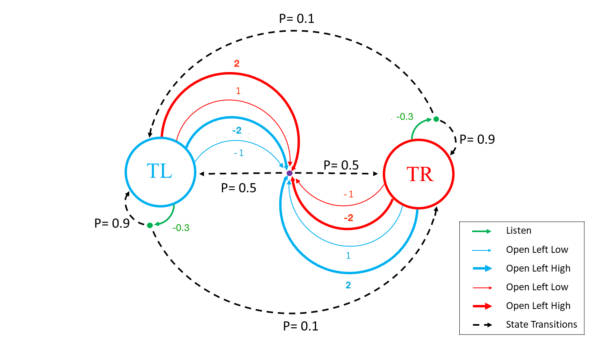
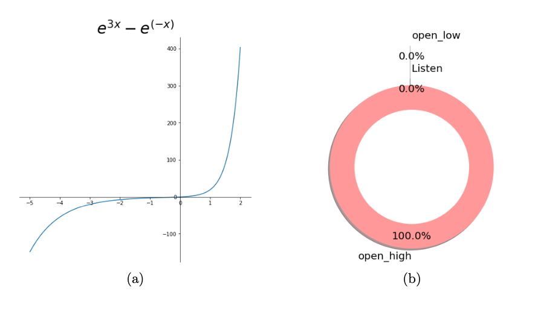
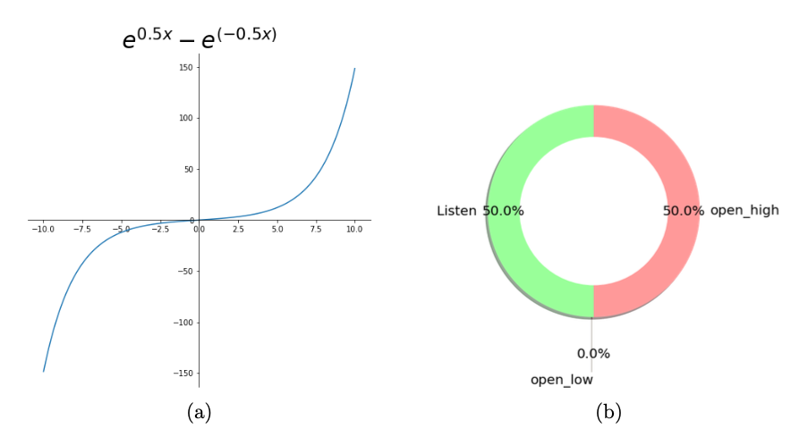
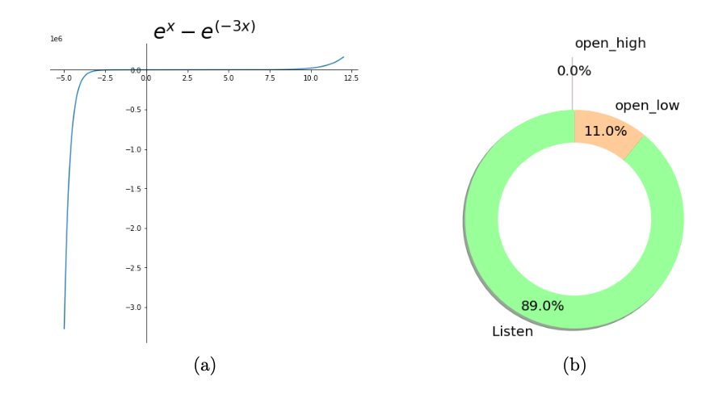
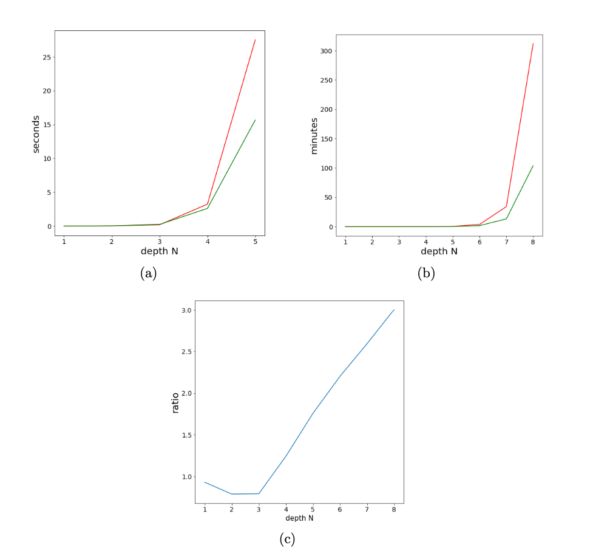

# Risk-Sensitive POMDP Solver

*Efficient algorithms for decision-making under uncertainty with risk preferences. Reduces computational complexity from exponential to linear while maintaining solution quality.*

**Associated Publication:** [WIAS Preprint 2977](https://www.wias-berlin.de/preprint/2977/wias_preprints_2977.pdf)


---


## Overview

This project implements and compares solution methods for risk-sensitive Partially Observable Markov Decision Processes (POMDPs), based on [my research](https://www.wias-berlin.de/preprint/2977/wias_preprints_2977.pdf)
Risk-sensitive POMDPs account for an agent's risk preferences using utility functions instead of purely optimizing rewards.

### The Problem

In many real-world applications, such as financial trading, planning or fund allocation agents must make decisions under uncertainty with incomplete information.

POMDPs model scenarios where the agent cannot fully observe the environment state (partial observability) and the agent must balance exploration and exploitation.

Risk-sensitive POMDPs extend this framework by incorporating exponential utility functions, allowing agents to express risk preferences mathematically.

Traditional solutions to these type of problem lead to infinite dimensional state spaces.
The paper proposes the use of utility functions that are sums of exponentials sacrificing the generality of the solution in favor of computational efficiency.
The approximating properties of the exponential function means that a wide range of utility functions can still be covered, the sigmoid among others.

### What This Project Does

This implementation provides:

1. **The Tiger Problem Environment**: A classic POMDP benchmark where an agent must decide whether to open doors while listening for a tiger's location with noisy observations. The classic problem is extended for the purpose of this project, in order to include stochastic transitions and risk decision making.

2. **Two Solution Methods**:
   - Implementation of the Bäuerle-Rieder (2017) algorithm for risk-sensitive POMDPs
   - The proposed alternative method
   
3. **Comparative Analysis**: Simulation framework to evaluate and compare both approaches across different risk sensitivity parameters.

The code demonstrates how risk preferences affect decision-making in partially observable environments, with applications to finance, robotics, and healthcare.

It shows that the proposed solution using the utility functions that are sums of exponentials manages to portray different risk aversion profiles and optimize for them successfully.

### Technical Approach

The implementation uses:
- Dynamic programming for belief state updates
- Exponential utility functions parameterized by risk sensitivity coefficient
- Monte Carlo simulations for policy evaluation
- Comparative analysis of risk-averse vs. risk-neutral strategies

This work resulted in a co-authored publication at the Weierstrass Institute for Applied Analysis and Stochastics (WIAS).

---

## The Tiger Problem

A generalized version of the repetitive Tiger problem is used (Kaelbling, Littman & Cassandra, 1998). In the classic Tiger problem, a decision-maker faces two closed doors, behind one of which is a tiger (punishment) and behind the other is a treasure (reward). The agent can either open a door or listen to tiger sound for information about the tiger's location. The sound signal is not fully reliable, with 20% probability of being heard from the wrong door. Each time the agent opens a door, it takes the reward/punishment and the problem resets with the tiger's position randomly determined.
Our generalized version has three extensions: 
First, the tiger's position can change during a trial, with 10% chance at the start of each epoch. 

Second, the immediate reward (punishment) of opening doors is not observable during repeats. The agent only has estimations of its gains until the end of all trials, when the accumulated reward and punishments are revealed. 

Third, the action space is expanded so the agent can bet on its decision at different investment levels. The agent can open each door either conservatively (low stake actions) for lower reward and punishment or rush to the doors for bigger reward if correct and more damage if incorrect

---

## Methods Implemented

Bäuerle-Rieder (2017) implements value iteration where utility is applied only at the final step. The belief space is a joint probability distribution over (hidden states × wealth levels). At each step, this joint distribution is updated via the SAY rule, requiring a single but complex update operation per iteration. The method must pre-compute and store value functions for all possible discretized belief distributions, which grows exponentially with the number of wealth levels.
It is implemented in BR_agent.py

Our multi-variate agent sacrifices generalization for computational efficiency. Under the assumption that the utility function can be written as U(R) = Σᵢ wᵢ·exp(λᵢ·R), we decompose the problem into separate components, creating independent risk-adjusted belief distributions (θᵢ) for each exponential term. At each step, these distributions update independently via simple matrix operations, and risk-sensitivity is incorporated throughout the planning process (not just at the end). The key efficiency gain comes from tracking only reachable state trajectories rather than all possible belief-wealth combinations, reducing the state space from millions to thousands.
It is implemented in MO_agent.py

---
## Results
The following figures offer a quick glance into our model. Specifically they show:

The setup of our extended tiger problem.
How our model simulates different utility functions and thus different risk profiles of agents.
How our model compares to standard pomdp solving methods with regards to computational efficiency.


### Problem Setup

*Figure 1: The extended Tiger Problem with stochastic transitions. The agent can choose between listening (green) or opening doors at different risk levels (blue/red). Dashed lines show 10% probability of tiger position changes.*

### Risk Profile Simulation
<table>
  <tr>
    <td></td>
    <td></td>
    <td></td>
  </tr>
  <tr>
    <td align="center">Risk-Seeking Agent</td>
    <td align="center">Risk-Neutral Agent</td>
    <td align="center">Risk-Averse Agent</td>
  </tr>
</table>

*Figure 2: Different utility functions and their resulting optimal policies. Left shows risk-seeking behavior (rushing to doors), center shows balanced approach, right shows risk-averse behavior (gathering more information before acting).*


### Computational Efficiency

*Figure 3: Computation time vs. problem depth. Our multi-variate method (green) scales linearly while Bäuerle-Rieder (red) grows exponentially beyond depth N=5.*


---


## Installation

```bash 
# Clone the repository 
git clone https://github.com/agk947/risk-sensitive-pomdp.git 
cd risk-sensitive-pomdp 
# Install dependencies 
pip install -r requirements.txt 
# Run the notebook 
jupyter notebook Simulations.ipynb 
```
---


## Usage

### Quick Start 
The easiest way to explore the project is through the Jupyter notebook: 
```bash jupyter notebook Simulations.ipynb ``` 

This notebook demonstrates: 
Setting up the Tiger Problem environment 
 Running both Bäuerle-Rieder and proposed method agents 
 Comparing performance across different risk parameters

---

## References

### Primary Publication 
**Kapetanis, A.** (Co-author). "Risk Sensitive Partially Observable Markov Decision Processes with utility functions that are sums of exponentials." WIAS Preprints, 2977 (2022). [https://www.wias-berlin.de/preprint/2977/wias_preprints_2977](https://www.wias-berlin.de/preprint/2977/wias_preprints_2977.pdf) 
### Key References 
**Bäuerle, N., & Rieder, U.** (2017). "Partially Observable Risk-Sensitive Markov Decision Processes."
https://arxiv.org/abs/1504.03530

### Related Work 
This implementation builds on the theoretical framework of risk-sensitive Markov decision processes and POMDPs, with applications to: 
- Financial portfolio optimization, 
- Robust control in robotics   
- Planning under uncertainty 
- Resource allocation with risk constraints


